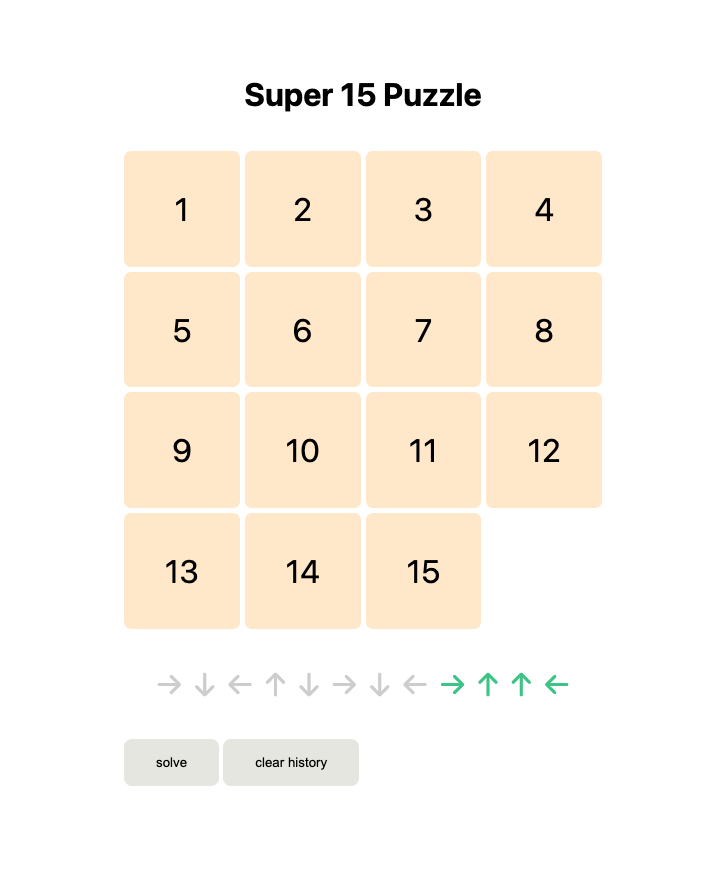

# 15 puzzle solver [DEMO](https://krist7599555.github.io/15puzzle-wasm)

## Control
use arrow key to control

## Technique
- rust wasm 
- svelte
- A* ?



```rust
use lazy_static::lazy_static;
use std::collections::{ HashMap, VecDeque, HashSet };
use std::time::Instant;
use std::iter::repeat;
use rand::seq::SliceRandom;

static FINISH_TABLE: &str = "123456789ABCDEF0";

lazy_static! {

  static ref INDEX_TO_COOR: Vec<(i32, i32)> = (0..16)
    .map(|pos| { (pos / 4, pos % 4) })
    .collect();

  static ref MOVE_POSITION: Vec<Vec<usize>> = (0..16)
    .map(|pos| { 
      let (i, j) = (pos / 4, pos % 4);
      let mut dirs = vec![];
      if j > 0 { dirs.push(pos-1) }
      if j < 3 { dirs.push(pos+1) }
      if i > 0 { dirs.push(pos-4) }
      if i < 3 { dirs.push(pos+4) }
      return dirs;
    })
    .collect();

  static ref INVERSE_DIRECTIONS: HashMap<char, char> = vec![
    ('U', 'D'),
    ('L', 'R'),
    ('R', 'L'),
    ('D', 'U')
  ].into_iter().collect();

  static ref DIR_2_CHAR: HashMap<i32, char> = vec![
    (-4, 'U'),
    (-1, 'L'),
    (1, 'R'),
    (4, 'D'),
  ].into_iter().collect();

  static ref PRECOMPUTED_ANSWERS: HashMap<String, String> = generate_precomputed_answer(14);
}

fn start_idx(table: &str) -> usize {
  return table.find('0').unwrap()
}

fn walk(table: &str, i: usize, j: usize) -> String {
  let mut s: Vec<char> = table.chars().into_iter().collect();
  s.swap(i, j);
  let s2: String = s.iter().collect();
  return s2;
}

fn heuristic(table: &str) -> i32 {
  return table.chars().enumerate().map(|(idx, val)| {
    let (ai, aj) = INDEX_TO_COOR[idx];
    let (bi, bj) = INDEX_TO_COOR[FINISH_TABLE.find(val).unwrap()];
    return (ai - bi).abs() + (aj - bj).abs()
  }).sum();
}

#[derive(Debug, Clone)]
struct State {
  table: String,
  path: String,
  cost: i32,
}

impl State {
  fn ways(&self) -> Vec<State> {
    let pos = start_idx(&self.table);
    return MOVE_POSITION[pos].iter().map(|&nex_pos| {
      return State {
        table: walk(&self.table, pos, nex_pos),
        path: format!("{}{}", self.path, DIR_2_CHAR[&(nex_pos as i32 - pos as i32)]),
        cost: self.cost + 1,
      }
    }).collect()
  }
}


fn generate_table(mut table:  String, mut iter: usize) -> String {
  let mut prv = 100000;
  let mut cur = start_idx(&table);
  let mut rng = rand::thread_rng();
  while iter > 0 {
    let &nex = MOVE_POSITION[cur].choose(&mut rng).unwrap();
    if nex != prv {
      table = walk(&table, cur, nex);
      prv = cur;
      cur = nex;
      iter -= 1;
    }
  }
  return table;
}

fn str_grid(inp: &String, n: usize) -> String {
  let mut res = vec![];
  for i in (0..inp.len()).step_by(n) {
    res.push(&inp[i..(i+n)]);
  }
  return res.join("\n");
}

fn generate_precomputed_answer(n: usize) -> HashMap<String, String> {
  let mut memo = HashSet::new();
  let mut ans = vec![State {table: FINISH_TABLE.to_string(), path: "".to_string(), cost: 0 }];
  for i in 0.. {
    if i >= ans.len() {
      break
    }
    for nex in ans[i].ways() {
      if nex.path.len() > n {
        break
      }
      if !memo.contains(&nex.table) {
        memo.insert(nex.table.to_string());
        ans.push(nex)
      }
    }
  }
  return ans
    .iter()
    .map(|s| { (
      s.table.to_string(), 
      s.path
        .chars()
        .rev()
        .map(|c| INVERSE_DIRECTIONS.get(&c).unwrap())
        .collect::<String>()
    )})
    .collect();
}

fn solve(table: &String) -> String {
  let mut memo: HashSet<String> = HashSet::new();  
  let mut dp: Vec<VecDeque<State>> = repeat(VecDeque::new()).take(128).collect();
  let mut mn = heuristic(&table) as usize;
  dp[mn].push_back(State {
    table: table.clone(),
    cost: 0,
    path: "".to_string(),
  });

  loop {
    while dp[mn].is_empty() { mn += 1 }
    if let Some(curr) = dp[mn].pop_front() {
      if curr.table == FINISH_TABLE {
        return curr.path
      }
      else if let Some(ans) = PRECOMPUTED_ANSWERS.get(&curr.table) {
        return format!("{}{}", curr.path, ans);
      }
      else {
        for next in curr.ways() {
          if !memo.contains(&next.table) {
            let pos = next.cost as usize + heuristic(&next.table) as usize;
            memo.insert(next.table.to_string());
            dp[pos].push_back(next);
            if pos < mn { 
              mn = pos
            }
          }
        }
      }
    }
  }
}

fn simulate_walk(table: &String, dir: char) -> String {
  let pos = start_idx(&table);
  return walk(table, pos, match dir {
    'U' => pos - 4,
    'L' => pos - 1,
    'R' => pos + 1,
    'D' => pos + 4,
    _ => panic!("not match dir {}", dir)
  })
}
fn simulate_walks(table: &String, dir: &String) -> String {
  return dir
    .chars()
    .fold(table.to_string(), |t, d| simulate_walk(&t, d))
}

fn test(n: usize) {
  let start = Instant::now();
  let tab = generate_table(FINISH_TABLE.to_string(), n);
  let dir = solve(&tab);
  let end = start.elapsed();
  let sim = simulate_walks(&tab, &dir);
  assert_eq!(sim, FINISH_TABLE);
  println!("PASS {} ({:.2?}): {}", dir.len(), end, dir)
}
```
